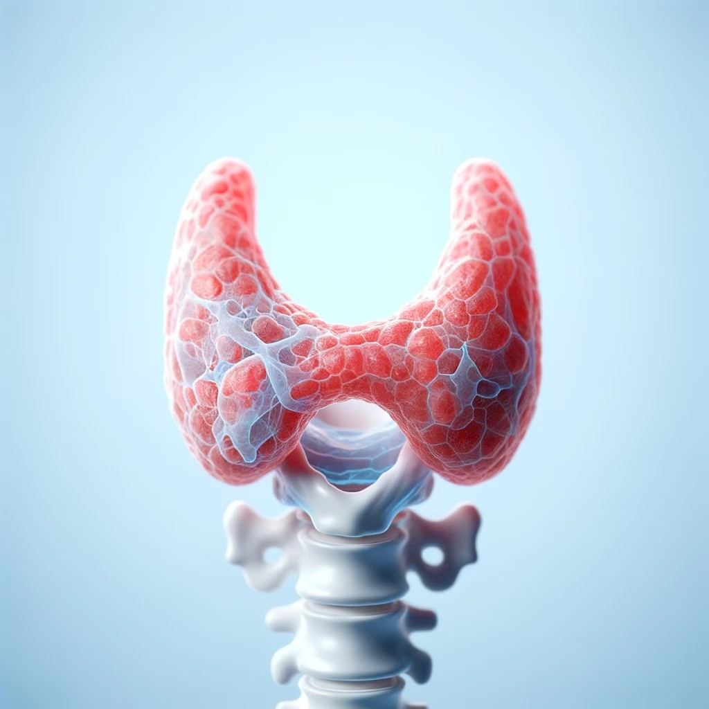

Thyroid Disease Detection

Thyroid Gland
 
Description

This project focuses on the early detection of thyroid diseases using machine learning models. Early detection of thyroid disorders can lead to timely treatment and better health outcomes.
Features

    Data Collection and Preprocessing: Collecting thyroid-related data and preparing it for analysis.
    Exploratory Data Analysis (EDA): Visualizing the dataset to identify patterns and insights.
    Feature Engineering: Enhancing the dataset with additional features for improved model performance.
    Model Training: Training machine learning models on the preprocessed dataset.
    Model Evaluation: Assessing the performance of trained models using various metrics.
    Prediction: Using the trained model to predict the presence of thyroid diseases in new data.

Installation

To install and run this project, follow the steps below:

git clone https://github.com/vikalp026var/Thyroid_Disease_Detection

cd thyroid-disease-detection

conda create -n <your environment name> 
conda activate <your environment name>

python app.py
Accuracy:99.64%

Dataset Description for Thyroid Disease Detection

The dataset for "Thyroid Disease Detection" comprises various features that can be potentially linked to thyroid diseases. Below is a brief description of each feature:

    age: Age of the patient (numeric).
    sex: Gender of the patient (F for Female, M for Male, and ? for unknown).
    on thyroxine: Indicates if the patient is on thyroxine medication (f for No, t for Yes).
    query on thyroxine: Query regarding thyroxine (f for No, t for Yes).
    on antithyroid medication: Indicates if the patient is on anti-thyroid medication (f for No, t for Yes).
    sick: Indicates if the patient is sick (f for No, t for Yes).
    pregnant: Indicates if the patient is pregnant (f for No, t for Yes).
    thyroid surgery: Indicates if the patient has had thyroid surgery (f for No, t for Yes).
    I131 treatment: Indicates if the patient has undergone I131 treatment (f for No, t for Yes).
    query hypothyroid: Query regarding hypothyroid (f for No, t for Yes).
    query hyperthyroid: Query regarding hyperthyroid (f for No, t for Yes).
    lithium: Indicates if the patient has taken lithium (f for No, t for Yes).
    goitre: Presence of goitre (f for No, t for Yes).
    tumor: Presence of tumor (f for No, t for Yes).
    hypopituitary: Indicates hypopituitary condition (f for No, t for Yes).
    psych: Indicates psychiatric symptoms (f for No, t for Yes).
    TSH measured: Indicates if TSH is measured (f for No, t for Yes).
    TSH: Thyroid-stimulating hormone level (numeric).
    T3 measured: Indicates if T3 is measured (f for No, t for Yes).
    T3: Triiodothyronine level (numeric).
    TT4 measured: Indicates if TT4 is measured (f for No, t for Yes).
    TT4: Total Thyroxine level (numeric).
    T4U measured: Indicates if T4U is measured (f for No, t for Yes).
    T4U: Thyroxine uptake level (numeric).
    FTI measured: Indicates if FTI is measured (f for No, t for Yes).
    FTI: Free Thyroxine Index (numeric).
    TBG measured: Indicates if TBG is measured (f for No, t for Yes).
    TBG: Thyroid-binding globulin level (numeric or ? for unknown).
    referral source: Source of referral (e.g., SVHC, other, SVI, STMW).
    binaryClass: Classification (P or N, possibly denoting Positive or Negative).

This dataset appears to be comprehensive and captures various aspects related to thyroid diseases. The features encompass demographic data, medical history, and laboratory test results. By analyzing this dataset, one can develop a robust model for thyroid disease detection.
